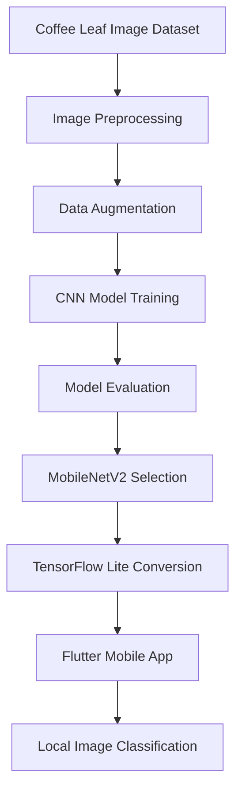

# Coffee Plant Disease Classification Using an Embedded CNN in a Mobile App

This repository documents an academic project focused on the classification of coffee plant health conditions using image processing, convolutional neural networks, and an embedded mobile application.

The project was originally developed as a final undergraduate thesis in Control and Automation Engineering at INATEL. The original source code is no longer available, so this repository serves as a technical case study describing the problem, methodology, architecture, model selection, results, and lessons learned.

## Overview

Coffee crops are highly affected by diseases and pests, which can reduce productivity and cause significant financial losses. Early identification of unhealthy leaves can support faster decision-making and improve disease control strategies.

This project proposes a mobile solution capable of classifying coffee leaves as healthy or unhealthy using a convolutional neural network embedded directly into a mobile application.

The solution was designed to run locally on the device, without requiring a remote server for inference.

## Main Contributions

- Developed an end-to-end mobile AI pipeline, from dataset preparation to on-device inference.
- Evaluated multiple CNN architectures for coffee leaf image classification.
- Selected and deployed MobileNetV2 using TensorFlow Lite.
- Integrated the trained model into a Flutter mobile application.
- Validated the solution with real field images from coffee plants.

## Project Goals

- Classify coffee leaves as healthy or unhealthy using image-based analysis.
- Train and evaluate different convolutional neural network architectures.
- Select a model suitable for mobile deployment.
- Convert the trained model to TensorFlow Lite.
- Integrate the model into a Flutter mobile application.
- Validate the solution using field images captured from real coffee plants.

## Technologies Used

- Python
- TensorFlow
- TensorFlow Lite
- OpenCV
- Flutter
- Dart
- Mobile inference
- Image processing
- Convolutional Neural Networks

## Dataset

The project used the RoCoLe dataset, a robust coffee leaf image dataset containing images of healthy and unhealthy coffee leaves.

The images were preprocessed and divided into training, validation, and test sets. Data augmentation techniques were also applied to improve the model generalization.

## Image Processing and Data Preparation

The data preparation pipeline included:

- Image normalization
- Image resizing
- Dataset splitting into training, validation, and test sets
- Data augmentation using:
  - Rotation
  - Zoom
  - Flip

The images were resized and normalized before being used as input to the neural network.

## Neural Network Architectures Evaluated

Several CNN architectures were evaluated to identify the best model for the proposed application:

| Model | Test Accuracy | Loss |
|---|---:|---:|
| MobileNetV2 | 99.65% | 0.0155 |
| InceptionV3 | 98.61% | 0.0558 |
| VGG19 | 98.95% | 0.0536 |
| ResNet50 | 99.30% | 0.0281 |
| ResNet152V2 | 99.30% | 0.0788 |

MobileNetV2 was selected as the final model because it achieved the best accuracy and lowest loss while also being suitable for mobile deployment.

## Mobile Application

The trained neural network was converted to TensorFlow Lite format and embedded into a Flutter mobile application.

The app allowed users to:

- Capture a photo of a coffee leaf using the device camera
- Select an image from the device gallery
- Run the classification model locally on the device
- Display the classification result and confidence level

The model inference was performed directly on the mobile device, without the need for cloud processing.

## Field Testing

After integrating the neural network into the mobile application, field tests were performed using real coffee leaf images captured directly from coffee plants.

The system was tested with healthy and unhealthy leaves that had not been used during training, validation, or testing.

The model correctly classified the tested samples, with confidence levels ranging from 80% to 100%.

## Results

The final solution demonstrated that it is possible to combine convolutional neural networks and mobile applications to create an accessible tool for agricultural disease classification.

Key results:

- Best model: MobileNetV2
- Test accuracy: 99.65%
- Loss: 0.0155
- Local mobile inference using TensorFlow Lite
- Successful field validation with real coffee leaf images

## Project Architecture

## Repository Status

The original source code is no longer available.

This repository is maintained as a project documentation and technical case study, summarizing the development process, methodology, results, and main technical decisions.

## Lessons Learned

This project provided practical experience with:

- Computer vision applied to agriculture
- Convolutional neural network training and evaluation
- Transfer learning with well-known CNN architectures
- TensorFlow Lite model conversion
- Mobile AI deployment
- Flutter-based mobile development
- Real-world validation of machine learning models

## Possible Future Improvements

Future versions of this project could include:

- Classification of specific coffee diseases
- Severity level estimation
- Larger and more diverse datasets
- Real-time camera inference
- Cloud-based model updates
- Explainable AI techniques for visualizing disease regions
- Deployment as a production-ready mobile application

## Academic Paper

The full academic paper is available here:

[Classification of Coffee Plantation Diseases Using a Convolutional Neural Network Embedded in a Mobile Application](https://biblioteca.inatel.br/cict/acervo%20publico/Sumarios/Artigos%20de%20TCC/TCC_Graduação/Engenharia%20de%20Controle%20e%20Automação/2022/TCC_2_Semestre/Classificação%20de%20Doenças%20em%20Plantações%20Cafeeiras%20Utilizando%20uma%20Rede%20Neural%20Convolucional%20Embarcada%20e.pdf)

## Authors

- Guilherme Ferreira Nogueira Paiva
- Vinicius Azevedo Monteiro

## Keywords

`computer-vision` `deep-learning` `cnn` `tensorflow` `tensorflow-lite` `flutter` `mobile-ai` `image-classification` `agriculture` `coffee-leaf-disease`

